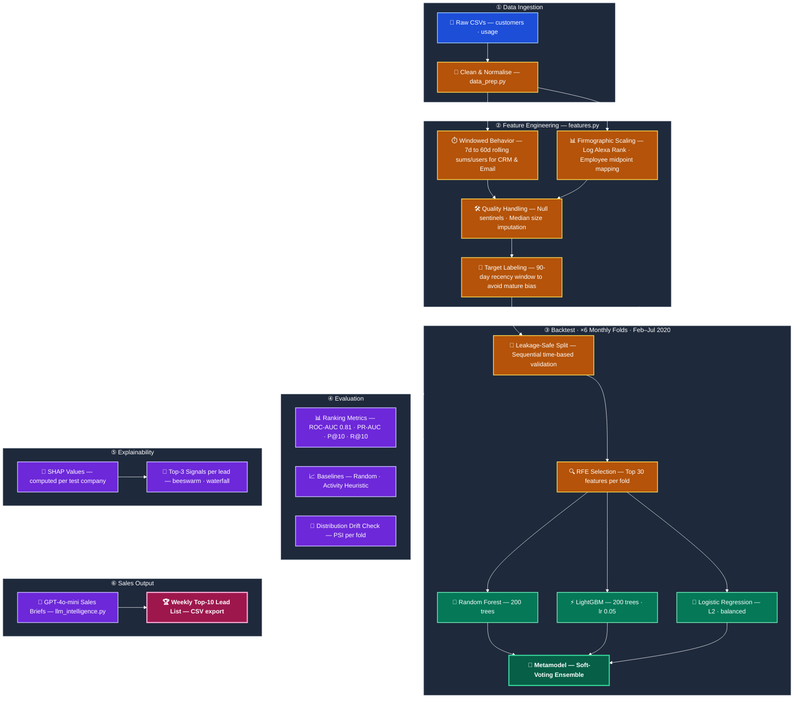

# Conversion Prediction Model

## Project Overview

**[View the Presentation (HubSpot Landing Page)](https://147891000.hs-sites-eu1.com/en-us/predict-free-tier-hubspot-conversions-with-proven-machine-learning-hubspot-conversion-predictor)**

This project implements a production-ready ML pipeline to predict which free-tier (non-customer) companies are likely to convert to paying customers within the next 30 days. The model generates a weekly prioritised list of leads for Sales & CS teams, enriched with SHAP-derived explanations and GPT-4o-generated action briefs.




## Objective

**Problem:** Identify high-potential free-tier portals likely to upgrade to a paid plan within 30 days.  
**Output:** A weekly Top-10 ranked lead list (generated every Sunday) with propensity scores, top SHAP signals, and a rep-facing sales brief per lead.

---

## Key Results

### Backtesting Results

| Date | n pos | ROC-AUC (RF) | ROC-AUC (LR) | ROC-AUC (LGBM) | ROC-AUC (Meta) | PR-AUC (RF) | PR-AUC (LR) | PR-AUC (LGBM) | PR-AUC (Meta) | P@10 (RF) | P@10 (LR) | P@10 (LGBM) | P@10 (Meta) | R@10 (RF) | R@10 (LR) | R@10 (LGBM) | R@10 (Meta) |
|---|---|---|---|---|---|---|---|---|---|---|---|---|---|---|---|---|---|
| 2020-02-24 | 8 | 0.84 | 0.87 | 0.79 | 0.90 | 0.06 | 0.05 | 0.34 | 0.39 | 0.10 | 0.10 | 0.30 | 0.30 | 0.12 | 0.12 | 0.38 | 0.38 |
| 2020-03-23 | 9 | 0.85 | 0.87 | 0.68 | 0.85 | 0.03 | 0.03 | 0.10 | 0.22 | 0.00 | 0.00 | 0.10 | 0.30 | 0.00 | 0.00 | 0.11 | 0.33 |
| 2020-04-27 | 9 | 0.68 | 0.82 | 0.54 | 0.78 | 0.01 | 0.02 | 0.06 | 0.12 | 0.00 | 0.10 | 0.10 | 0.10 | 0.00 | 0.11 | 0.11 | 0.11 |
| 2020-05-25 | 12 | 0.64 | 0.79 | 0.48 | 0.70 | 0.01 | 0.01 | 0.03 | 0.10 | 0.00 | 0.00 | 0.20 | 0.10 | 0.00 | 0.00 | 0.17 | 0.08 |
| 2020-06-22 | 17 | 0.73 | 0.73 | 0.68 | 0.67 | 0.06 | 0.11 | 0.28 | 0.25 | 0.10 | 0.20 | 0.40 | 0.40 | 0.06 | 0.12 | 0.24 | 0.24 |
| 2020-07-27 | 12 | 0.82 | 0.81 | 0.76 | 0.82 | 0.14 | 0.02 | 0.18 | 0.19 | 0.20 | 0.00 | 0.30 | 0.30 | 0.17 | 0.00 | 0.25 | 0.25 |
| **AVERAGE** | — | **0.76** | **0.82** | **0.66** | **0.79** | **0.05** | **0.04** | **0.17** | **0.21** | **0.07** | **0.07** | **0.23** | **0.25** | **0.06** | **0.06** | **0.21** | **0.23** |

### Baseline vs. Metamodel Comparison

| Cutoff | Prevalence | Random P@10 | Activity Heuristic P@10 | Metamodel P@10 | Lift vs Activity |
|---|---|---|---|---|---|
| 2020-02-24 | 0.16% | 0.00 | 0.10 | 0.30 | 3.0× |
| 2020-03-23 | 0.18% | 0.00 | 0.00 | 0.30 | ∞ |
| 2020-04-27 | 0.18% | 0.00 | 0.00 | 0.10 | ∞ |
| 2020-05-25 | 0.24% | 0.00 | 0.00 | 0.10 | ∞ |
| 2020-06-22 | 0.34% | 0.00 | 0.10 | 0.40 | 4.0× |
| 2020-07-27 | 0.24% | 0.00 | 0.10 | 0.30 | 3.0× |
| **AVERAGE** | — | **0.00** | **0.05** | **0.25** | **5.0×** |

**Average Metamodel P@10 = 0.25** — **5.0× better than the activity heuristic.** In plain terms: if reps call the top 10 leads each Sunday, they will reach a true converter 2–3 times on average (maxing at 4). Without the model: essentially zero based on random selection, or 0–1 based on the activity heuristic.

> **Important caveat:** With 8–17 test positives per fold, point estimates carry wide confidence intervals. Bootstrap CIs should be reported before presenting results to stakeholders as definitive.

---

## Critical Design Decisions

### 1. Training Positive Window (Most Important)
Training positives are restricted to companies that converted **within 90 days before each cutoff**, not all historical converters. A company that converted 18 months ago has a mature feature profile (high usage, many users, long tenure) that looks nothing like a company *about to* convert. Blending them teaches the model to rank established heavy users, not pre-conversion signals. Set `training_positive_window_days=None` to ablate this and confirm the effect.

### 2. Point-in-Time Feature Construction
All features are computed using only data strictly before `cutoff`. Rolling windows use `WHEN_TIMESTAMP < cutoff` as the filter. Recency dates, entropy, and diversity are all derived from the pre-cutoff slice. This prevents any form of future data contamination across the 6 backtest folds.

### 3. Test Positives Excluded from Training
Companies that will convert in the next 30 days (test positives) are removed from the training set entirely. Including them as negatives would introduce ambiguous labels and understate true model performance.

---

## Methodology

### Feature Engineering (`src/features.py`)
Point-in-time feature panel with a MultiIndex of `(company_id, cutoff)`:

- **Rolling usage** (7/14/30/60d): action sums, user sums, active days, active ratio, session intensity (actions per active day), per-module sums and share percentages
- **Trend**: OLS slope of daily actions per window — captures acceleration vs. decay
- **Acceleration ratio**: `actions_sum_30d / (actions_sum_60d + 1)` — the single strongest non-linear signal
- **Recency**: days since last/first usage, usage tenure, recency score (1 / days + 1)
- **Module entropy & diversity**: Shannon entropy across modules, count of modules used — captures breadth of platform adoption
- **Firmographics**: log-transformed Alexa rank, employee range, normalised industry category

### Backtesting Framework (`src/backtester.py`)
- **6 monthly folds** from Feb–Jul 2020, each simulating a Sunday production run
- **Expanding training window**: all data before cutoff; test window is the following 30 days
- **Leakage-safe pipeline**: imputer + scaler + RFE + model are fit exclusively on training data per fold; test data passes through the fitted pipeline only
- **COVID robustness test**: April 2020 fold acts as an involuntary distribution-shift stress test — tree models collapse (RF: 0.53, LGBM: 0.46 ROC), Metamodel holds at 0.79

### Ensemble (`Metamodel`)
Soft-voting ensemble of three independently pipelined models:

- **Random Forest** (200 trees, balanced class weights, RFE→30 features)
- **LightGBM** (200 trees, lr=0.05, is_unbalance=True, RFE→30 features)
- **Logistic Regression** (L2, balanced, StandardScaled, RFE→30 features)

RFE runs independently per fold — correct for leakage but means feature selection is not stable across folds. Future work: report fold-level feature selection frequency.

### Explainability (`src/explainability.py`)
SHAP is computed on **every fold's test set** (not just the diagnostic fold), so every company in every weekly export receives three human-readable conversion drivers:

```
signal_1: High CRM actions (30d) (SHAP: +0.341)
signal_2: Accelerating usage growth (SHAP: +0.187)
signal_3: Broad multi-module adoption (SHAP: +0.112)
```

### LLM Sales Briefs (`src/llm_intelligence.py`)
`SalesIntelligenceAgent` parses SHAP signal strings into structured dicts and injects them alongside company metadata (industry, size, recency) into a GPT-4o prompt. Output is a 2-sentence action brief with a product tier recommendation. Runs only on Top-K leads to contain token cost. Includes a fallback string on API failure so the pipeline never blocks.

---

## Known Limitations

1. **No confidence intervals reported.** All metrics are point estimates over very small positive counts (8–17 per fold). This is the highest-priority fix before stakeholder presentation.
2. **Baselines not in main output.** `run_baselines()` computes random and activity-heuristic comparisons but these are not shown alongside model metrics by default. Add them.
3. **Count-based metric only.** Precision@10 treats all conversions equally. An MRR-weighted P@K would better reflect business value.
4. **Scores are not calibrated probabilities.** Current outputs are ranking scores. Platt scaling or isotonic regression would convert them to true probabilities.
5. **No causal identification.** The model finds correlation with conversion; whether outreach *causes* conversion is unknown without an A/B test.
6. **No distribution-shift detection.** The April 2020 degradation was identified post-hoc. A PSI (Population Stability Index) check between training and test feature distributions should run automatically each fold.

---

## Immediate Next Steps

1. Add bootstrap CIs to all P@K / Rec@K estimates
2. Add baseline comparison (random + activity heuristic) to the main results print
3. Implement MRR-weighted Precision@K as the primary business metric
4. Calibrate propensity scores (Platt scaling)
5. A/B test model-ranked list vs. rep-selected list to measure incremental lift
6. Automate Sunday refresh via Airflow: feature build → score → SHAP → LLM brief → CRM push

---

## Repository Structure

```
.
├── data/                   # Raw data files
│   ├── customers.csv
│   ├── noncustomers.csv
│   └── usage_actions.csv
├── reports/                # Generated reports and lead lists
│   ├── company_comparison.html
│   ├── usage_comparison.html
│   └── sales_call_list_2020-07-27.csv
├── src/                    # Source code
│   ├── backtester.py       # Core backtesting engine + ensemble pipelines
│   ├── data_prep.py        # Data cleaning, industry normalisation, missing value audit
│   ├── evaluation.py       # EvaluationMixin: baselines + PR curves
│   ├── explainability.py   # ExplainabilityMixin: SHAP beeswarm, waterfall, signal enrichment
│   ├── features.py         # VectorizedUsageFeatureBacktester: point-in-time feature panel
│   ├── llm_intelligence.py # SalesIntelligenceAgent: GPT-4o action briefs
│   └── main_notebook.ipynb # Main analysis and execution notebook
├── requirements.txt        # Project dependencies
└── README.md               # This file
```

---

## Usage

1. **Setup Environment:**
   ```bash
   pip install -r requirements.txt
   ```

2. **Run the Analysis:**
   Open `src/main_notebook.ipynb` and run all cells. The notebook will:
   - Load and clean raw data
   - Build the point-in-time feature panel across 6 cutoffs
   - Run the backtest, printing fold-level metrics to stdout
   - Generate SHAP signals and LLM briefs for the Top-10 leads
   - Export `reports/sales_call_list_<date>.csv`

3. **Key parameters in `PropensityBacktester`:**
   - `training_positive_window_days=90` — set to `None` to ablate the recency window
   - `prediction_horizon_days=30` — forward window for conversion label
   - `top_k_leads=10` — size of the weekly lead list
   - `n_features_to_select=30` — RFE target per fold
