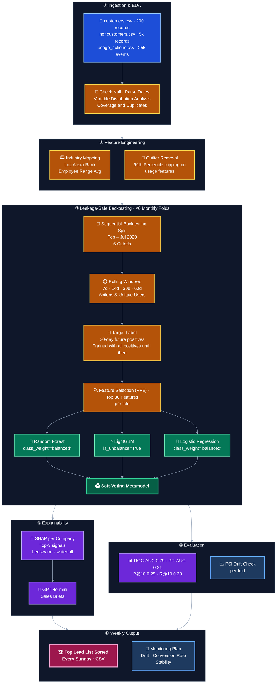

# Conversion Prediction Model

## Project Overview

**[View the Presentation (HubSpot Landing Page)](https://147891000.hs-sites-eu1.com/en-us/predict-free-tier-hubspot-conversions-with-proven-machine-learning-hubspot-conversion-predictor)**

This project implements a production-ready ML pipeline to predict which free-tier (non-customer) companies are likely to convert to paying customers within the next 30 days. The model generates a weekly Top-10 ranked lead list (generated every Sunday) with propensity scores, SHAP-derived explanations, and GPT-4o-mini-generated sales briefs.



---

## Objective

**Problem:** Identify high-potential free-tier portals likely to upgrade to a paid plan within 30 days.  
**Output:** A weekly Top-10 ranked lead list (generated every Sunday) with propensity scores, top SHAP signals, and a rep-facing sales brief per lead.

---

## Key Results

| Metric | Value |
|---|---|
| Peak PR-AUC | 0.39 (Feb 2020 fold) |
| Average Metamodel P@10 | 0.25 |
| Lift vs. activity heuristic | **5.0×** |
| Lift vs. random selection | **~107×** |

### Backtesting Results

| Date | n pos | ROC-AUC (RF) | ROC-AUC (LR) | ROC-AUC (LGBM) | ROC-AUC (Meta) | PR-AUC (RF) | PR-AUC (LR) | PR-AUC (LGBM) | PR-AUC (Meta) | P@10 (RF) | P@10 (LR) | P@10 (LGBM) | P@10 (Meta) | R@10 (RF) | R@10 (LR) | R@10 (LGBM) | R@10 (Meta) |
|---|---|---|---|---|---|---|---|---|---|---|---|---|---|---|---|---|---|
| 2020-02-24 | 8 | 0.84 | 0.87 | 0.79 | 0.90 | 0.06 | 0.05 | 0.34 | 0.39 | 0.10 | 0.10 | 0.30 | 0.30 | 0.12 | 0.12 | 0.38 | 0.38 |
| 2020-03-23 | 9 | 0.85 | 0.87 | 0.68 | 0.85 | 0.03 | 0.03 | 0.10 | 0.22 | 0.00 | 0.00 | 0.10 | 0.30 | 0.00 | 0.00 | 0.11 | 0.33 |
| 2020-04-27 | 9 | 0.68 | 0.82 | 0.54 | 0.78 | 0.01 | 0.02 | 0.06 | 0.12 | 0.00 | 0.10 | 0.10 | 0.10 | 0.00 | 0.11 | 0.11 | 0.11 |
| 2020-05-25 | 12 | 0.64 | 0.79 | 0.48 | 0.70 | 0.01 | 0.01 | 0.03 | 0.10 | 0.00 | 0.00 | 0.20 | 0.10 | 0.00 | 0.00 | 0.17 | 0.08 |
| 2020-06-22 | 17 | 0.73 | 0.73 | 0.68 | 0.67 | 0.06 | 0.11 | 0.28 | 0.25 | 0.10 | 0.20 | 0.40 | 0.40 | 0.06 | 0.12 | 0.24 | 0.24 |
| 2020-07-27 | 12 | 0.82 | 0.81 | 0.76 | 0.82 | 0.14 | 0.02 | 0.18 | 0.19 | 0.20 | 0.00 | 0.30 | 0.30 | 0.17 | 0.00 | 0.25 | 0.25 |
| **AVERAGE** | — | **0.76** | **0.82** | **0.66** | **0.79** | **0.05** | **0.04** | **0.17** | **0.21** | **0.07** | **0.07** | **0.23** | **0.25** | **0.06** | **0.06** | **0.21** | **0.23** |

### Baseline vs. Metamodel Comparison

| Cutoff | Prevalence | Random P@10 | Activity Heuristic P@10 | Metamodel P@10 | Lift vs Activity |
|---|---|---|---|---|---|
| 2020-02-24 | 0.16% | 0.00 | 0.10 | 0.30 | 3.0× |
| 2020-03-23 | 0.18% | 0.00 | 0.00 | 0.30 | ∞ |
| 2020-04-27 | 0.18% | 0.00 | 0.00 | 0.10 | ∞ |
| 2020-05-25 | 0.24% | 0.00 | 0.00 | 0.10 | ∞ |
| 2020-06-22 | 0.34% | 0.00 | 0.10 | 0.40 | 4.0× |
| 2020-07-27 | 0.24% | 0.00 | 0.10 | 0.30 | 3.0× |
| **AVERAGE** | — | **0.00** | **0.05** | **0.25** | **5.0×** |

**Average Metamodel P@10 = 0.25** — **5.0× better than the activity heuristic.** In plain terms: if reps call the top 10 leads each Sunday, they will reach a true converter 2–3 times on average (maxing at 4 in June 2020). Without the model: essentially zero based on random selection, or 0–1 based on the activity heuristic.

> **Note on model selection:** The Metamodel was selected over individual models because it leads on the two most business-relevant metrics (P@10 and R@10) and shows the greatest stability across folds — it rarely has the worst score in any period. ROC-AUC is the only metric where LR edges ahead (0.82 vs 0.81), but that gap is negligible given the primary objective.

---

## Critical Design Decisions

### 1. Training Positive Window
Training positives are **all historical converters up to each cutoff** — any company that converted on or before the cutoff date is treated as a positive. This maximises training signal given the small dataset (~200 total converters). A 90-day recency window was tested but reduced training positives to ~25–50 per fold, making models unstable at this dataset size. The recency-window approach is recommended in production once a larger customer base provides sufficient positives per fold.

### 2. Point-in-Time Feature Construction
All features are computed using only data strictly before each `cutoff`. Rolling windows filter on `WHEN_TIMESTAMP < cutoff`. Recency dates, entropy, and diversity are derived from the pre-cutoff slice only. This prevents any form of future data contamination across all 6 backtest folds.

### 3. Class Imbalance Handling
SMOTE was deliberately not applied. With only 8–17 true positives per fold, synthetic samples may not represent real conversion behaviour. Instead, `class_weight='balanced'` is used for Random Forest and Logistic Regression, and `is_unbalance=True` for LightGBM — achieving the balancing effect at the algorithm level with no additional leakage risk.

### 4. Evaluation Metric Choice
Precision@K is the primary metric because sales rep time is the scarce resource — a false positive wastes a call, while missing a converter is acceptable (there will be more next week). PR-AUC is reported over ROC-AUC as the curve metric because ROC-AUC is misleadingly optimistic under severe class imbalance (~3.8% conversion rate).

---

## Methodology

### Data
5,203 total portals across three datasets: `customers.csv` (200 paying customers), `noncustomers.csv` (5,003 free-tier), and `usage_actions.csv` (25,387 weekly usage records, Jan 2019–Jul 2020). Conversion rate: 3.8%.

Key data quality issues addressed:
- **INDUSTRY**: missing for 64–74% of records → encoded as `UNKNOWN` after regex normalisation into 10 buckets
- **Alexa Rank**: nulls assigned sentinel value 16,000,001 (max_rank + 1), then log-transformed
- **Usage outliers**: extreme values capped at the 99th percentile before modelling
- **Duplicate IDs** in non-customers: resolved by retaining the most complete record

### Feature Engineering (`src/features.py`)
Point-in-time feature panel with a MultiIndex of `(company_id, cutoff)`:

**Structural features** (slow-moving, dominate LightGBM gain rankings):
- `ALEXA_RANK_LOG`: log(1 + ALEXA_RANK) — web presence proxy
- `EMPLOYEE_RANGE`: midpoint of employee size bucket
- `usage_tenure_days`: span between first and last usage event
- `days_since_first_usage` / `days_since_last_usage`: platform adoption age and recency
- `recency_score`: 1 / (days_since_last_usage + 1) — bounded [0,1]

**Behavioural features** (rolling windows of 7d, 14d, 30d, 60d across CRM Contacts, Companies, Deals, and Email modules):
- `{module}_actions_sum_{w}`: action volume per module per window
- `{module}_users_sum_{w}`: unique user breadth per module per window
- `{module}_per_users_{w}`: intensity of usage per user
- `active_days_{w}` / `active_ratio_{w}`: usage frequency and consistency
- `actions_per_active_day_{w}`: session intensity
- `actions_trend_{w}`: OLS slope of daily action counts — usage momentum
- `pct_{module}_{w}`: share of total actions per module — usage mix signal

**Derived signals:**
- `actions_acceleration`: `actions_sum_30d / (actions_sum_60d + 1)` — ramp-up vs. deceleration
- `module_entropy`: Shannon entropy of action share across all modules — **consistently the single highest-gain feature in LightGBM**
- `module_diversity`: count of distinct modules used — breadth of platform adoption

### Backtesting Framework (`src/backtester.py`)
- **6 monthly folds** (cutoffs: Sundays from Feb–Jul 2020), each simulating a real Sunday production run
- **Expanding training window**: all data before cutoff; test window is the following 30 days
- **Leakage-safe pipeline**: imputer → scaler → RFE → model are fit exclusively on training data per fold; test data passes through the fitted pipeline only
- **RFE** selects top 30 features independently per fold — correct for leakage; feature selection stability across folds is a known area for future improvement

### Ensemble (`Metamodel`)
Soft-voting ensemble (`VotingClassifier(voting='soft')`) averaging calibrated probabilities from three independently pipelined models:

| Model | Config |
|---|---|
| Random Forest | 200 trees, max_depth=8, class_weight='balanced' |
| LightGBM | 200 trees, lr=0.05, is_unbalance=True |
| Logistic Regression | L2, class_weight='balanced', StandardScaled |

### Explainability (`src/explainability.py`)
SHAP (SHapley Additive exPlanations) is computed on the LightGBM model per fold. Each company in every weekly export receives its top-3 conversion drivers:

```
signal_1: Long active usage tenure (SHAP: +5.44)
signal_2: High actions per active day - 30d (SHAP: +2.12)
signal_3: High USERS_CRM_DEALS - 60d (SHAP: +1.90)
```

This enables stakeholder trust (reps understand why a company is ranked #1) and actionability (each lead has a plain-English conversion rationale).

### LLM Sales Briefs (`src/llm_intelligence.py`)
`SalesIntelligenceAgent` parses SHAP signal strings and injects them alongside company metadata (industry, size, recency) into a GPT-4o-mini prompt. Output is a concise action brief per lead. Runs only on the Top-10 leads to contain token cost. Includes a fallback string on API failure so the pipeline never blocks on the weekly export.

---

## Top Feature Importance (LightGBM, Cutoff 2020-06-22)

| Rank | Feature | Category | LightGBM Gain | Business Meaning |
|---|---|---|---|---|
| 1 | module_entropy | Structural | 675 | Multi-module adoption breadth |
| 2 | ALEXA_RANK_LOG | Structural | 665 | Web presence proxy |
| 3 | days_since_first_usage | Structural | 475 | Time on free tier |
| 4 | usage_tenure_days | Structural | 425 | Active usage span |
| 5 | actions_crm_contacts_per_user_60d | Behavioural | 275 | CRM contact density per user |
| 6 | days_since_last_usage | Structural | 255 | Recency of platform engagement |
| 7 | actions_trend_60d | Behavioural | 210 | Accelerating usage over 60 days |
| 8 | actions_trend_30d | Behavioural | 205 | Short-term usage acceleration |
| 9 | actions_crm_deals_sum_60d | Behavioural | 202 | Volume of CRM deals managed |
| 10 | users_crm_deals_sum_60d | Behavioural | 180 | Team deals pipeline adoption |

> **Key EDA finding:** The single most predictive behavioural signal is **team adoption**. Customers average 5.3 users on Contacts vs. 0.7 for non-customers (7.6× difference). CRM Contacts actions are 15× higher for converters. Single-user accounts almost never convert.

---

## Known Limitations

1. **All historical positives in training.** A company that converted 18 months ago has a mature feature profile that looks different from one about to convert. Windowed positive labelling (90-day window before cutoff) is the recommended fix once the customer base is larger.
2. **No confidence intervals reported.** All metrics are point estimates over 8–17 positives per fold. Bootstrap CIs should be reported before presenting results to stakeholders as definitive.
3. **Scores are not calibrated probabilities.** Current outputs are ranking scores, not true probabilities. Platt scaling or isotonic regression would convert them, enabling pipeline-level forecasting.
4. **INDUSTRY missingness.** 64–74% of records have no industry — the single largest data quality gap. Clearbit or Apollo.io enrichment by company domain (~$0.01/lookup) would directly improve the IND_TECH signal, a known strong predictor.
5. **No MRR-weighted metric.** Precision@10 treats all conversions equally. An MRR-weighted P@K would better reflect business value.
6. **No causal identification.** The model identifies correlation with conversion; whether outreach *causes* conversion requires an A/B test.
7. **No automated distribution-shift detection.** The April 2020 performance degradation (Metamodel ROC-AUC: 0.78) was identified post-hoc. A PSI (Population Stability Index) check between training and test feature distributions should run automatically each fold.

---

## Next Steps (Prioritised by Impact/Effort)

| Priority | Item | Effort |
|---|---|---|
| 🔴 High / Low | INDUSTRY enrichment via Clearbit/Apollo.io | Low |
| 🔴 High / Low | Score calibration (Platt scaling) | Low |
| 🔴 High / Low | MRR-weighted Precision@K | Low |
| 🔴 High / High | Windowed positive labelling (90-day window) | High |
| 🔴 High / High | LLM outreach openers at scale | High |
| 🔴 High / High | Survival analysis for time-to-conversion | High |
| 🟡 Low / Low | Score smoothing (EMA across weekly runs) | Low |
| 🟡 Low / Low | K-Fold cross-validation as a complement | Low |
| 🟡 Low / High | Full A/B test infrastructure | High |

---

## Repository Structure

```
.
├── data/                   # Raw data files
│   ├── customers.csv
│   ├── noncustomers.csv
│   └── usage_actions.csv
├── reports/                # Generated reports and lead lists
│   ├── company_comparison.html
│   ├── usage_comparison.html
│   └── sales_call_list_2020-07-27.csv
├── src/                    # Source code
│   ├── backtester.py       # Core backtesting engine + ensemble pipelines
│   ├── data_prep.py        # Data cleaning, industry normalisation, missing value audit
│   ├── evaluation.py       # EvaluationMixin: baselines + PR curves
│   ├── explainability.py   # ExplainabilityMixin: SHAP beeswarm, waterfall, signal enrichment
│   ├── features.py         # VectorizedUsageFeatureBacktester: point-in-time feature panel
│   ├── llm_intelligence.py # SalesIntelligenceAgent: GPT-4o-mini action briefs
│   └── main_notebook.ipynb # Main analysis and execution notebook
├── requirements.txt        # Project dependencies
└── README.md               # This file
```

---

## Usage

1. **Setup Environment:**
   ```bash
   pip install -r requirements.txt
   ```

2. **Run the Analysis:**
   Open `src/main_notebook.ipynb` and run all cells. The notebook will:
   - Load and clean raw data
   - Build the point-in-time feature panel across 6 cutoffs
   - Run the backtest, printing fold-level metrics to stdout
   - Generate SHAP signals and LLM briefs for the Top-10 leads
   - Export `reports/sales_call_list_<date>.csv`

3. **Key parameters in `PropensityBacktester`:**
   - `training_positive_window_days=None` — set to `90` to ablate the recency window (unstable at this dataset size; recommended for larger datasets)
   - `prediction_horizon_days=30` — forward window for conversion label
   - `top_k_leads=10` — size of the weekly lead list
   - `n_features_to_select=30` — RFE target per fold

---

*© 2026 Jordi Solé Casaramona. All rights reserved.*
